# Martian Token Crowdsale

## **Overview of the Token & Crowdsale Launch**
The Solidity smart contract is developed for the launch of KASEI coin, a fungible token based on the ERC-20 standard. A crowdsale contract is also deployed allowing buyers to participate in KASEI coin crowdsale. The process is executed on *Remix* IDE synced to the smart contract testing platform *Ganache* and hot storage wallets on *Metamask*.
****

## **Folder Structure**

* The `KaseiCoin.sol` contains the solidity smart contract code for the KaseiCoin contract.
* The `KaseiCoinCrowdsale.sol` contains the solidity smart contract code for the Crowdsale contract.
* The `Optional_KaseiCoinCrowdsale.sol` contains the solidity smart contract code for the Crowdsale contract of the optional challenge.
* The `Execution_Results` folder contains snapshots of the process execution of the smart contract on *Remix*.

## **Evaluation Evidence**

The process undertaken for the creation, deployment and crowdsale of the KASEI coin is provided in the figures below.

### Compiling Evidence

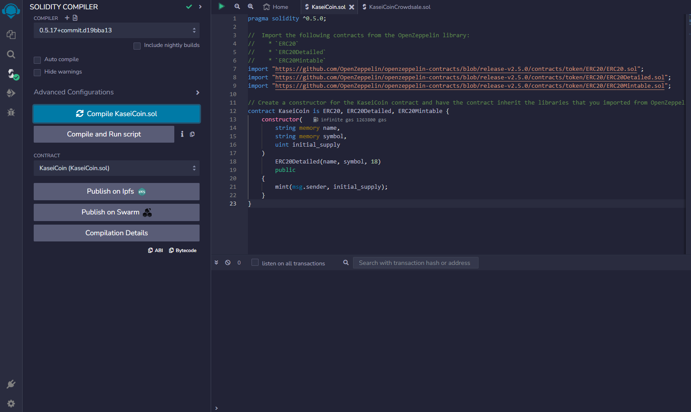

##### 
Figure 1 - Compiling the KaseiCoin Contract

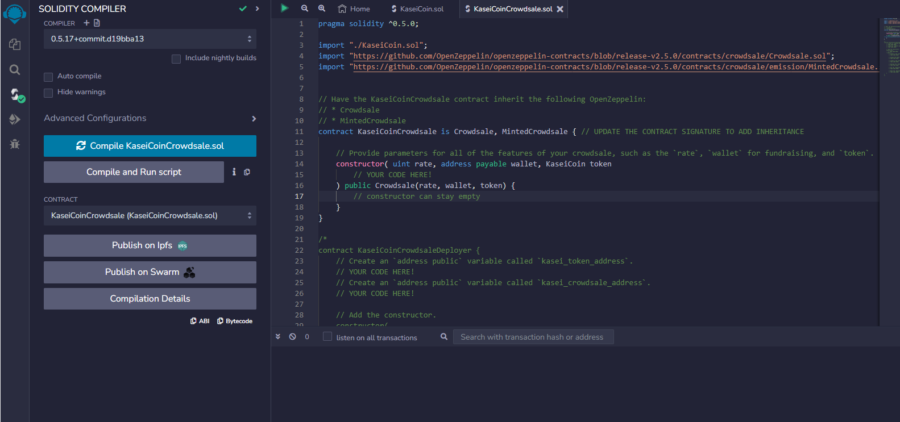

##### 
Figure 2 - Compiling the Crowdsale Contract

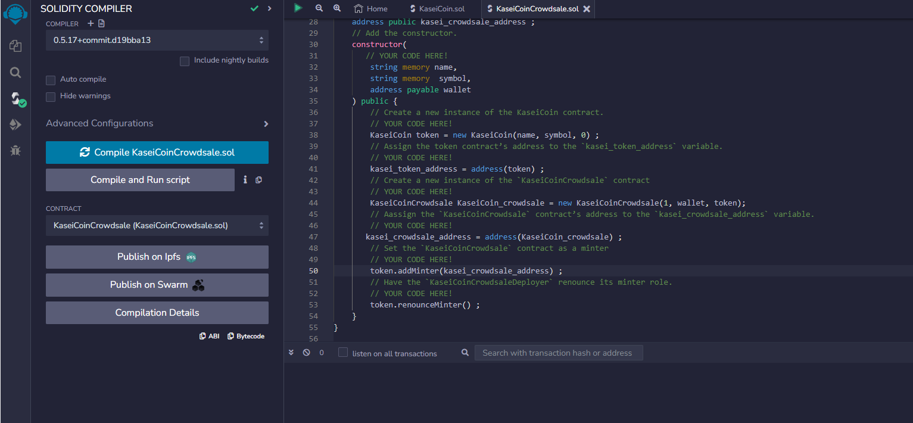

##### 
Figure 3 - Compiling the Crowdsale Deployer Contract

### Deploying and Testing the Smart Contract on Remix
The following presents the step-by-step execution of the smart contract on the *Remix* IDE as the testing platform. Once the contract is successfully compiled and deployed on the ethereum blockcahin, Ether deposits are made into the wallet for purchase of the KASEI coin and withdrawls are exhibited on the *Metamask* wallet.

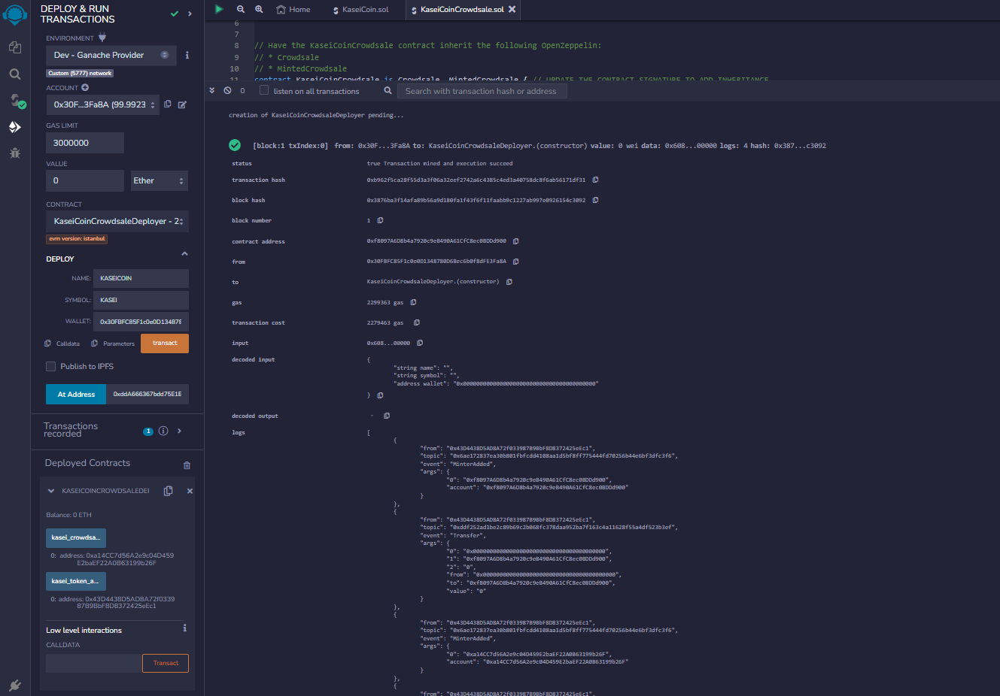

##### 
Figure 4 - Deploy Deployer

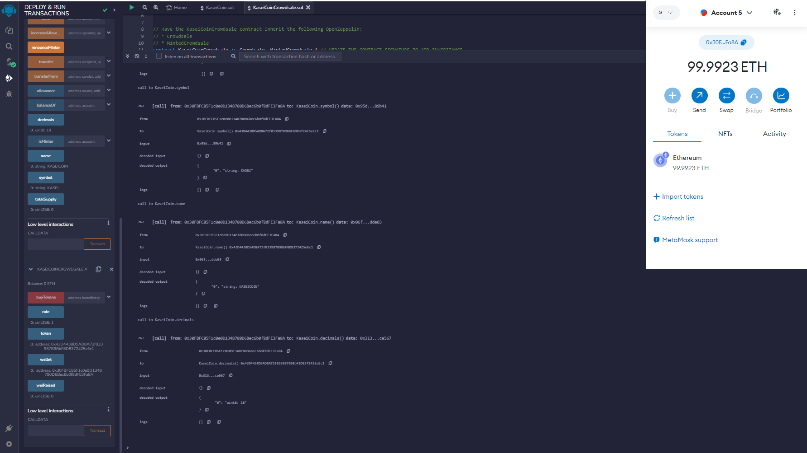

##### 
Figure 5 - Deploy Coin & Crowdsale

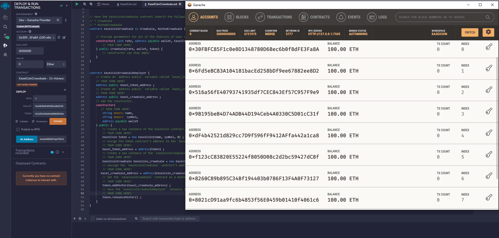

##### 
Figure 6 - Link Remix & Ganache

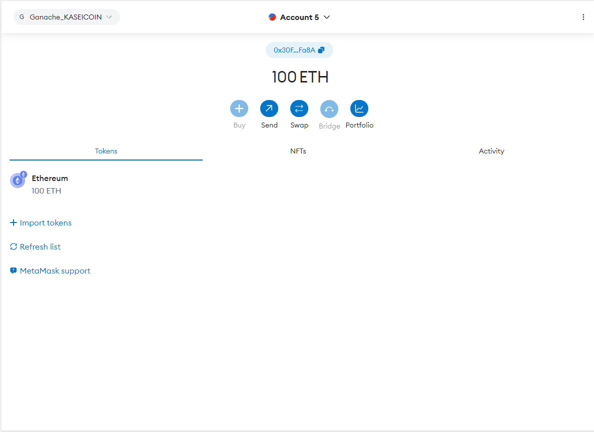

##### 
Figure 7 - Link Metamask

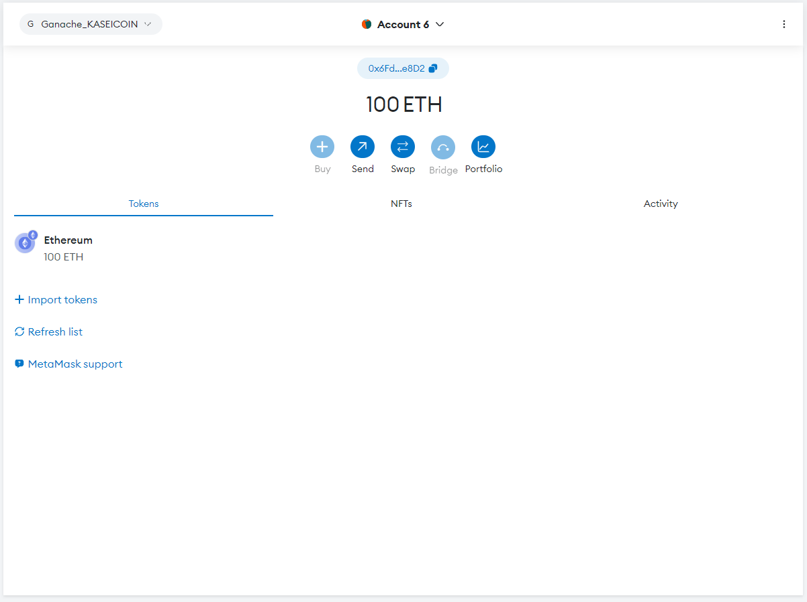

##### 
Figure 8 - Create Buyer Wallet

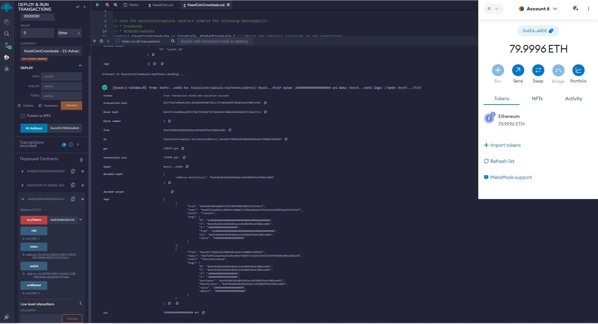

##### 
Figure 9 - Purchase KASEI

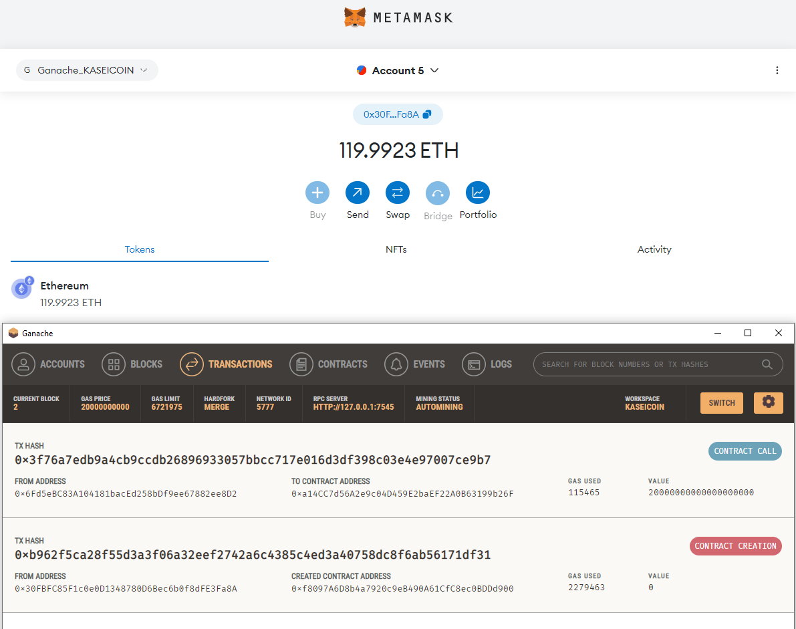

##### 
Figure 10 - Transaction Sucecss

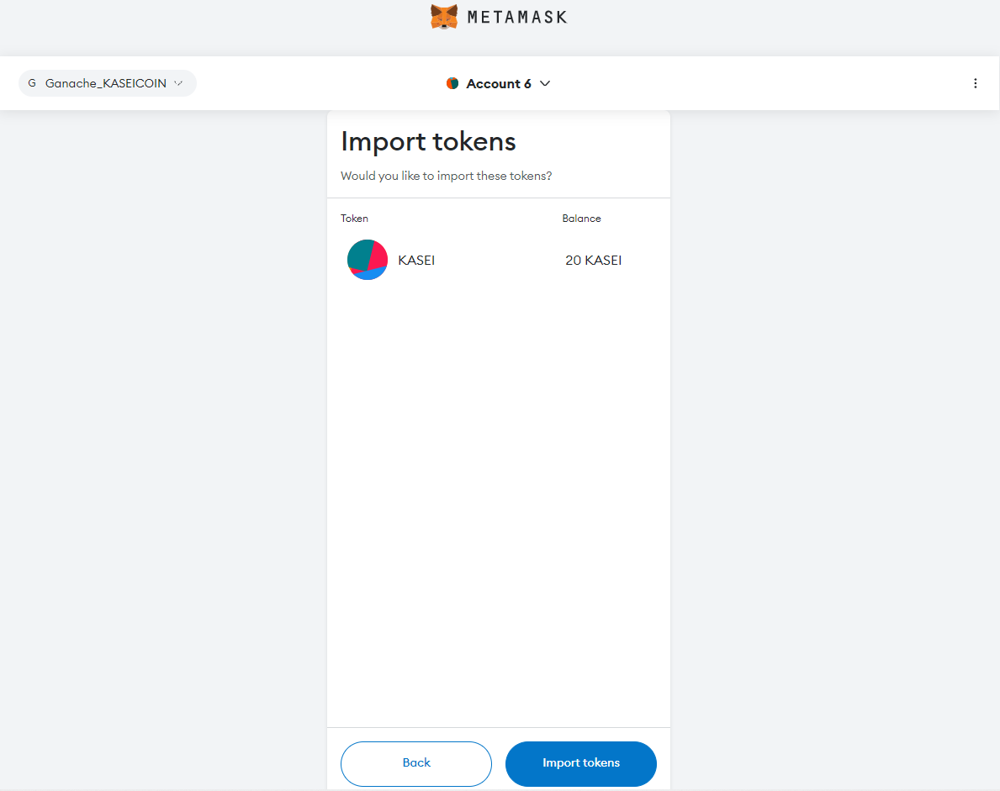

##### 
Figure 11 - KASEI Receieved

## **Optional: Extend the Crowdsale Contract by Using OpenZeppelin**

This section illustrates the sucessfull completion of the optional challenge. Additional OpenZeppelin contracts have been inherited to the existing contract allowind additional functionality to the crowdsale - `CappedCrowdsale` to set a cap for the goal of ETH to be raised, `TimeCrowdsale` to set a time limit for when the crowdsale opens and closes and `RefundablePostDeliveryCrowdsale ` to refund investors if goal is not reached.

### Compiling Evidence

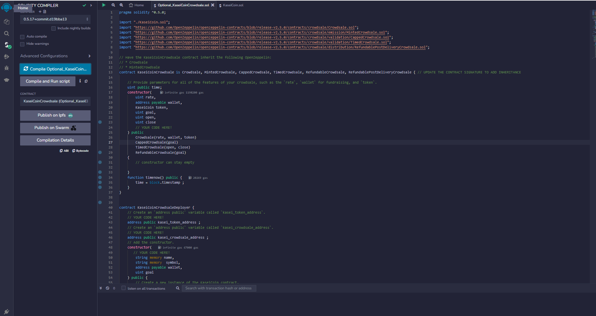

##### 
Figure 12 - Compiling the Updated Crowdsale Deployer Contract

### Deploying and Testing the Updated Smart Contract on Remix
The following section presents the step-by-step execution of the updated smart contract on the *Remix* IDE as the testing platform. The functionality of the updated contract is tested to raise funds within the allowed time frame (for convenience the crowdsale is set to close within 2 minutes). The goal (30ETH) was reached within the timeframe and evidence below shows the crowdsale could not be finalized (and ETH successfully collected) until the close time was reached. 
 

Note: A function to display the real-time Unix was necessary to be added to the deployer contract in order for these additional features to function properly. Otherwise the status of *isOpen()* remains unchanged indefinitely.
 

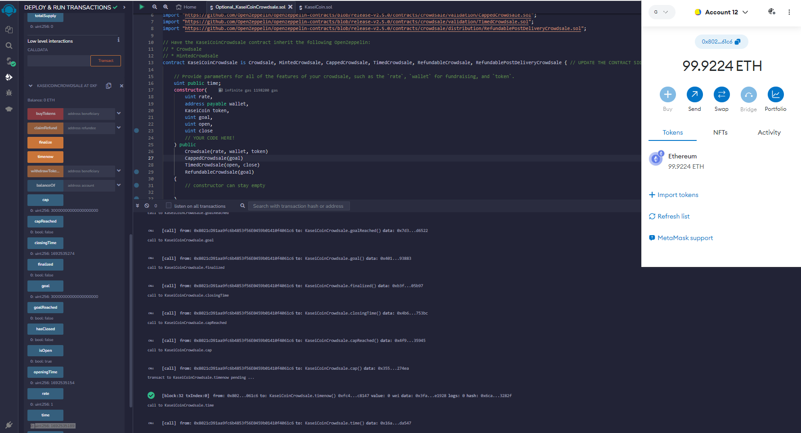

##### 
Figure 13 - Deploy New Deployer

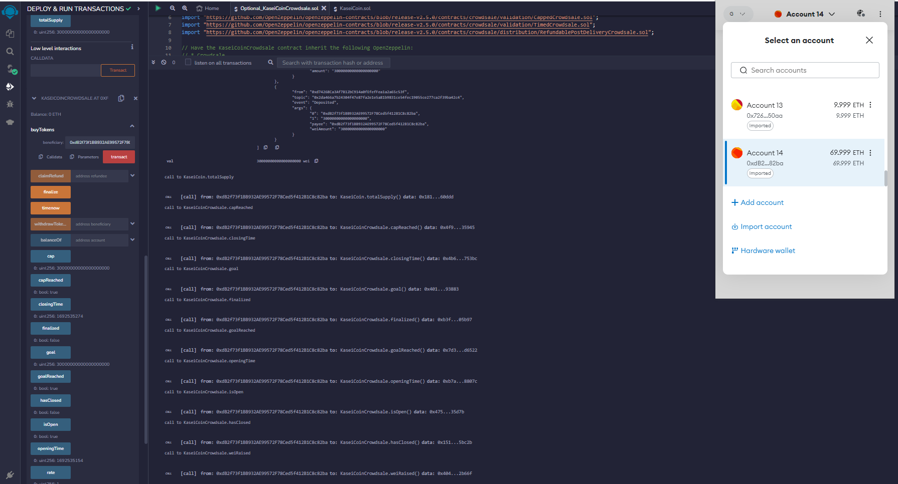

##### 
Figure 14 - Goal Reached Before Close Time

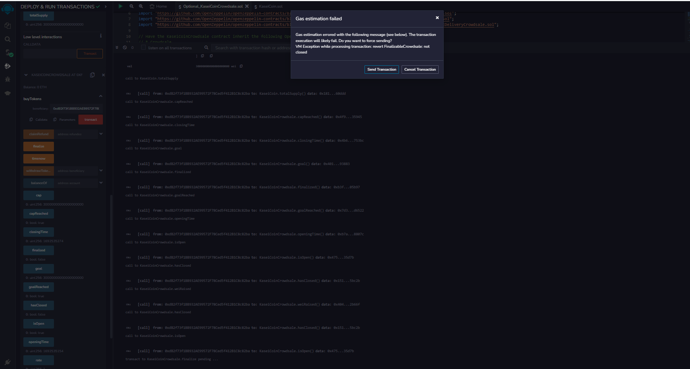

##### 
Figure 15 - Finalize Attempt Before Close

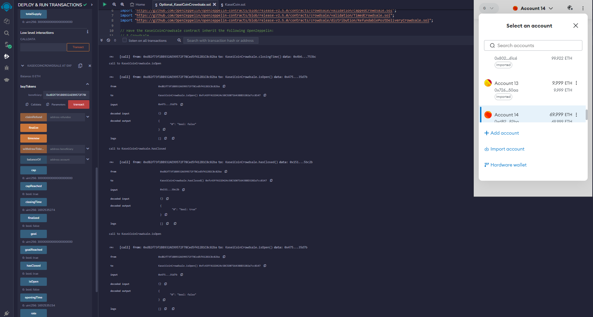

##### 
Figure 16 - Crowdsale Closed

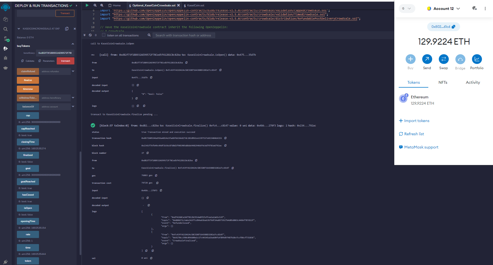

##### 
Figure 17 - Crowdsale Finalized & ETH Transferred
